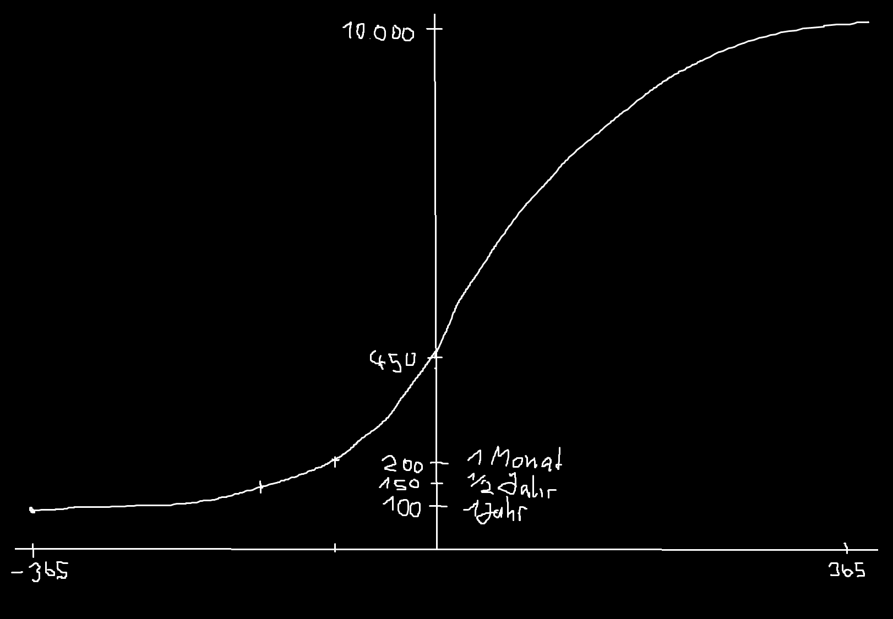

# Habit Hero

**Habit Hero** ist eine App, die Nutzern hilft, ihren persönlichen Fortschritt in verschiedenen Fähigkeiten (Skills) zu verfolgen und zu managen.

## Grundidee

- neue **Skills** können hinzufügt werden
- Skills haben einen **Namen** und eine **Regelmäßigkeit**
- Es gibt einen **Startwert (Elo)**
- am Skill wird das **+/- Gain** angezeigt
- User kann einstellen, an welchem Zeitpunkt des Tages ein **Gesamtbericht** angezeigt wird
- jeder Skill hat einen Button, an dem man abgeschlossene **Sessions** eintragen kann

- **Skill-Management**: Füge neue Skills mit individuellen Namen und festgelegten Regelmäßigkeiten hinzu.
- **Session-Tracking**: Für jeden Skill gibt es eine Option, um abgeschlossene Sessions zu dokumentieren. Regelmäßige Sessions führen zu einer Steigerung der Elo-Wertung.
- **Fortschrittsverfolgung**: Jeder Skill beginnt mit einem Startwert (Elo). Die Elo-Wertung steigt, wenn du deine Ziele erreichst und sinkt, wenn du Sessions auslässt.
- **Täglicher Gesamtbericht**: Stelle ein, zu welcher Tageszeit du einen Gesamtüberblick über deine Skills erhalten möchtest.

## Details

### Benutzeroberfläche
- **Minimalistisch & Intuitiv**: Die Oberfläche ist darauf ausgelegt, leicht zu navigieren und schnell Skills hinzuzufügen.
- **Fortschrittsübersicht**: Einfache Visualisierung des Fortschritts für eine effektive Verfolgung.

### Personalisierung
- **Individuelle Symbolik**: Wähle für jeden Skill ein persönliches Symbol aus.
- **Farbanpassung**: Personalisiere die Darstellung mit individuellen Farben für jeden Skill.

### Realistische Zielsetzung
- **Flexible Ziele**: Passe deine Zielsetzungen an deine Fähigkeiten und Zeitpläne an.
- **Anpassungsfähigkeit**: Die App erlaubt es, Ziele dynamisch zu ändern und an deinen Fortschritt anzupassen.

### ## Inkrementeller Fortschritt
- **Motivation durch Erreichbarkeit**: Setze erreichbare Ziele, um die Motivation zu steigern.
- **Belohnung kleiner Fortschritte**: Erkenne und feiere kleinere Leistungssteigerungen.
- **Markierung von Meilensteinen**: Identifiziere und würdige bedeutende Fortschritte in deinen Skills.